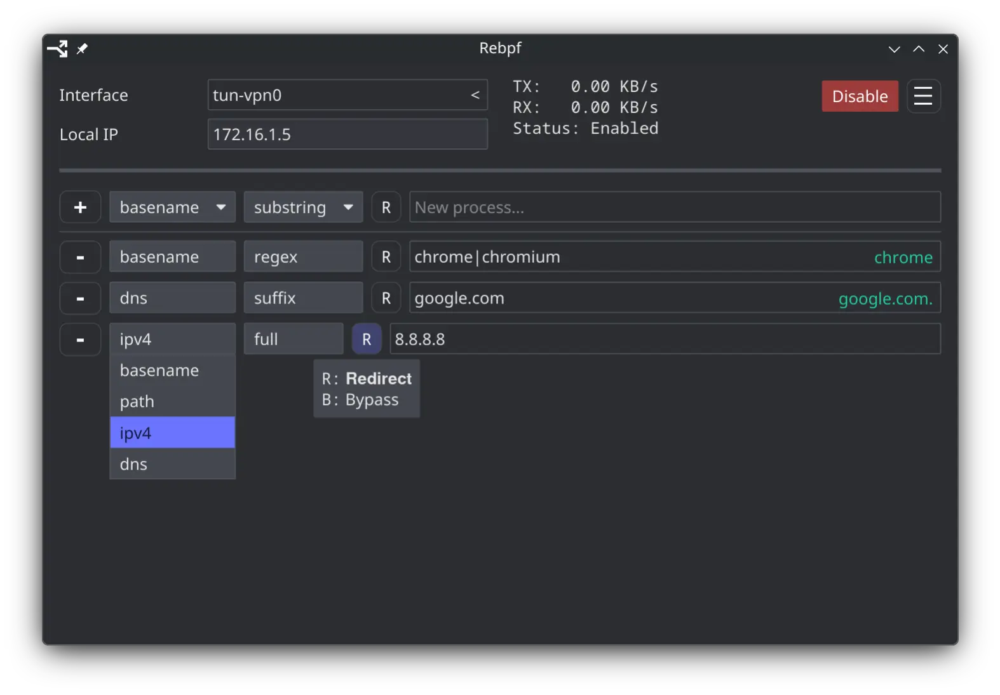

<div align="center">
  
  <h3>Rebpf</h3>
  Per-process network traffic redirection using eBPF (daemon + GUI app).
</div>




## Features

- Redirect traffic of a specific applications, IP or DNS address to a specific
interface, e.g. in or around a VPN.
- Without affecting the network configuration of any other program.
- Instantly changing settings through the GUI app, no need to restart your apps!
- Using D-Bus interface for integrations and CLI.


## Non-goals

- Complete network isolation: we allow programs to talk to LAN devices.
- Managing network interfaces: at least for now, you have to tell rebpf the
interface name: `busctl call service.rebpf / service.rebpf ChangeOutput s
new-ifname`, although we may add some way to issue notifications on traffic in
the future.


## Why

I wanted something like [Sing-box] with its per-process redirection capability,
but working entirely in kernel space, which looked like a perfect use case for
[eBPF] that I wanted to try out anyway.

If you're here for eBPF, I recommend also checking out [bpftrace], [libbpf],
and [docs.ebpf.io].

<!--

Aya-rs lib was promising at first, but its current direction [seems
questionable](https://github.com/aya-rs/aya/pull/1500), plus there're many
quirks and limitations of which helper function you can use where, which I
guess would be quite hard to consolidate in a usefully succinct abstraction.

-->

[eBPF]: https://ebpf.foundation/what-is-ebpf
[sing-box]: https://github.com/SagerNet/sing-box
[bpftrace]: https://bpftrace.org
[libbpf]: https://www.kernel.org/doc/html/latest/bpf/libbpf/index.html
[docs.ebpf.io]: https://docs.ebpf.io


## How

<details>
<summary>It's complicated. <i>Click to unfold.</i></summary>

[eBPF] is a technology allowing you to run your code directly in the kernel
without needing to write and distribute a full-fledged kernel module or worry
too much about breaking the kernel[^1]. The magic behind eBPF are a verifier
and a JIT compiler, ensuring your code can't loop, can't halt, can't modify
arbitrary kernel data, and doesn't take too long to complete.

[^1]: Note that it still very possible to render your system unusable with
certain types of eBPF programs. They can leak kernel data, alter or block
syscalls, or even alter memory of userspace programs.

eBPF programs run on events. The program context (a slice of kernel data the
program is allowed to read/write) is defined by the program type, basically,
which part of kernel subsystem calls your program. Some program types are only
allowed to observe events (kfuncs, tracing, security monitoring), bus some also
allow affecting the kernel behavior (packet filtering).

As for this project, we want to somehow make egress packets originating from a
socket created by a program matching a user-provided criteria to be
transparently redirected to a specific network interface.

The most obvious way to achieve this on Linux without eBPF would probably involve
network namespaces. A program and its descendants can be completely sandboxed
inside of their own network namespace. Even unprivileged programs
can create their own isolated network namespaces, which might then be
proxied to the global one by the program itself[^2], or be configured by some
privileged daemon in a way we need. The problem is it doesn't seem to be a
solution for already running applications. Linux doesn't provide an obvious way
to transfer arbitrary processes between namespaces from outside the process,
but if we would, for example, circumvent this limitation by injecting some code
using ptrace syscall, but this won't apply instantly nor transparently, due to
sockets created in a parent network namespace, still being bound to it, instead
of the new one, behaving as if the application is still there. So eBPF it is.

[^2]: The trick is to create a socket in a parent namespace and then either
inherit it in a sandboxed process or send it over a UNIX socket. The socket
remains bound to the namespace it was created in.

Checking if a process process falls under a criteria here is relatively
straightforward: we attach a program to [`cgroup/sock_create`] hook, triggered
when a process tries to create a new socket, giving us the ability access the
process's executable path, and compare it to a criteria. Similarly, we can
sweep existing sockets using [`iter/task_file`].

[`cgroup/sock_create`]: https://docs.ebpf.io/linux/program-type/BPF_PROG_TYPE_CGROUP_SOCK
[`iter/task_file`]: https://docs.ebpf.io/linux/program-type/BPF_PROG_TYPE_TRACING

Once we have a socket, the most convenient method to redirect traffic is to
tell the existing kernel code to do it. A privileged userspace application can
set an arbitrary 32bit [SO_MARK] on its sockets which in turn could be picked
up by dedicated firewall and routing rules. In this case, stateful connection
tracking, needed to correctly associate the ingress packets with the socket, is
already done by the kernel.

[SO_MARK]: https://www.man7.org/linux/man-pages/man7/socket.7.html

During normal operation the eBPF program can set socket marks on a newly
created sockets using [bpf_setsockopt()] available to [`cgroup/sock_create`]
programs. While during startup or after a change in configuration, it can
iterate over all the opened sockets using [`iter/task_file`] and send matched
process's info to the userspace daemon which can use [pidfd_getfd(2)] syscall
to set a mark on an already existing socket.

[bpf_setsockopt()]: https://docs.ebpf.io/linux/helper-function/bpf_setsockopt/
[pidfd_getfd(2)]: https://www.man7.org/linux/man-pages/man2/pidfd_getfd.2.html

The network configuration is dynamic. When a network device disappears, its
routing entries are removed automatically and need to be reconfigured when the
device reappears. Linux notifies userspace of the changes in network
configuration using multicast netlink. The daemon listens to these changes to
know when to update the routing rules, especially when Rebpf is configured to
allow LAN connectivity and has to actively mirror the state of the main routing
table for selected processes.

IP-based redirection is straightforward, the daemon simply creates the
corresponding routing entries for them. Matching DNS addresses is more
involved. When it's required, eBPF program checks ingress packets using
[`tcx/ingress`] program and copies ones that look like originating from a DNS
resolver into the userspace for processing. The daemon does the parsing and
maintains the corresponding routing entries.

[`tcx/ingress`]: https://docs.ebpf.io/linux/program-type/BPF_PROG_TYPE_SCHED_ACT

</details>


## Installation

Rebpf requires Linux kernel v7.0 or later.

- Manual
  ```sh
  # Install dependencies, see ./rebpf/default.nix and ./rebpf-gui/default.nix
  cargo build --release

  # Rebpf
  install -m 0755 -Dt /usr/bin ./target/release/rebpf
  install -m 0644 -Dt /etc/dbus-1/system.d/ ./contrib/service.rebpf.conf
  install -m 0644 -Dt /usr/share/polkit-1/actions/ ./contrib/service.rebpf.policy
  install -m 0644 -Dt /etc/systemd/system ./contrib/rebpf.service

  # Rebpf-gui
  install -m 0755 -Dt /usr/bin ./target/release/rebpf-gui
  install -m 0755 -Dt /usr/share/applications/ ./contrib/rebpf-gui.desktop
  ```

- NixOS
  ```nix
  # flake.nix
  {
    inputs.rebpf = {
      url = "github:one-d-wide/rebpf";
      inputs.nixpkgs.follows = "nixpkgs";
    };
  }
  ```

  ```nix
  # configuration.nix
  { inputs, ... }:
  {
    imports = [ inputs.rebpf.nixosModules.rebpf ];

    services.rebpf.enable = true;
    programs.rebpf-gui.enable = true;
  }
  ```


## Contributing

- `RUST_LOG=debug` or `--verbose` enables debug-logging.
- All required dev packages are collected in [./shell.nix], run `nix-shell` to
fetch them.
- When ran manually, [./rebpf/build-loader.sh] builds the eBPF program in
`./build/` and generates compile_commands.json.
- Run `./build/bpf-load` to quickly load the eBPF program and check whether the
verifier accepts it.
- The nix package requires `./Cargo.nix` to be kept in sync with `Cargo.lock`
using [crate2nix], see [./scripts/update.sh].
- Build with `--features=bpf-trace` to enable eBPF debug output in
`/sys/kernel/debug/tracing/trace_pipe`.

[./shell.nix]: ./shell.nix
[./rebpf/build-loader.sh]: ./rebpf/build-loader.sh
[crate2nix]: https://github.com/nix-community/crate2nix
[./scripts/update.sh]: ./scripts/update.sh

Rebpf manipulates [ip-rule(8)] and [ip-route(8)] entries to redirect traffic.
Here's a quick fish script to display a combined view of all routing rules with
the corresponding tables in order of decreasing priority.

[ip-rule(8)]: https://www.man7.org/linux/man-pages/man8/ip-rule.8.html
[ip-route(8)]: https://www.man7.org/linux/man-pages/man8/ip-route.8.html

<details>
<summary>Script. <i>Click to unfold.</i></summary>

```fish
#!/usr/bin/env fish

function ipr
    set -l visited_tables

    echo "Routing entries in order of decreasing priority"
    ip $argv rule list | while read -Ll line
        set -l table_id (string replace -r ".*\s" "" -- $line)
        set -a visited_tables $table_id
        set -l prio (string replace -r ":.*" "" -- $line)
        set -l rule (string replace -r "^\S*:\s*" "" -- $line | string replace -r "\s*lookup\s*\S*\$" "")
        echo
        echo PRIO: $prio, RULE: $rule, TABLE: $table_id
        switch $table_id
            case unicast blackhole unreachable prohibit nat
                echo $table_id
            case "*"
                ip -color=always $argv route show table $table_id
        end | while read -Ll line
            echo "    $line"
        end
    end

    ip $argv route show table all | while read -Ll line
        set -l table_id (string replace -fr "(.* )?table (\S+)( .*)?" "\$2" -- $line)
        switch $table_id
            case "" $visited_tables
                continue
        end
        set -a visited_tables $table_id
        echo
        echo ORPHANED TABLE: $table_id
        ip -color=always $argv route show table $table_id | while read -Ll line
            echo "    $line"
        end
    end
end
```

</details>

## License

This project is released under the [GPLv3].

Rebpf icons are based on "Arrow Split" from Google's [Material icons] licensed under [Apache 2.0].

[GPLv3]: ./LICENSE.
[Material icons]: https://fonts.google.com/icons
[Apache 2.0]: https://www.apache.org/licenses/LICENSE-2.0.html
